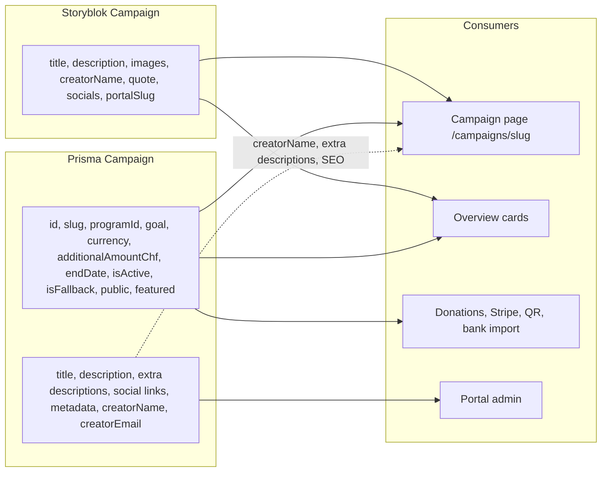

# Prisma campaign fields vs Storyblok content

Campaign records currently split across two systems: **Prisma** holds fundraising mechanics and a leftover copy of copy, **Storyblok** already owns title, description, images, and socials for the public page. Several Prisma “content” columns are never rendered.

---

## Visual overview

Join key: Storyblok `portalSlug` ↔ Prisma `slug`. The page loads the Storyblok story first, then hydrates stats from Prisma.

---

## Unused (no public/runtime consumer)

These are written by the portal form (and seed), selected in reads, and **never rendered or used in logic**. Public submission already stores the socials in Storyblok, not Prisma.

| Field | Notes |
|---|---|
| `linkWebsite` | Selected in `get` / `getByPortalSlug`, never displayed. Public submit writes it to Storyblok only. |
| `linkInstagram` | Same. Storyblok uses `instagramHandle` instead. |
| `linkTiktok` | Same. Storyblok uses `tiktokHandle`. |
| `linkFacebook` | Same. **Not even in the Storyblok Campaign component.** |
| `linkX` | Same. Storyblok uses `xHandle`. |
| `creatorEmail` | Portal form only. Never shown, never used to send mail. Public submit does not write it. |
| `legacyFirestoreId` → `getCampaignLink()` | Still used as a **lookup alias** in `getById` / `getPublicTitleById` (donations can pass old IDs). The URL it builds (`/campaign/{id}`) has **no route**. The portal table ignores `row.link` and builds `/campaigns/{slugify(title)}` instead. |

`isFallback` is **not** in the portal form. It is only set in seed/DB, but it **is** used at runtime (see below).

---

## Only used for display on the campaign page

These are Prisma content that still feed `/campaigns/[slug]`. Title and body copy on that page already come from Storyblok.

| Field | Where it shows |
|---|---|
| `secondDescriptionTitle` | Extra two-column block, only if **both** second and third descriptions are set |
| `secondDescription` | Same |
| `thirdDescriptionTitle` | Same |
| `thirdDescription` | Same |
| `metadataDescription` | Page SEO, only if **all three** metadata fields are set |
| `metadataOgImage` | Open Graph image |
| `metadataTwitterImage` | Twitter card image |
| `creatorName` | Hero “by {creator}”. Also on **overview cards**. Storyblok already has `creatorName`, but the UI still reads Prisma. |

Hero title and description come from Storyblok, not Prisma (`load-campaign-detail-data.ts`):

- `title`: `getCampaignTitle(story.content)`
- `description`: `story.content.description`
- `primaryImage`: `story.content.primaryImage`
- fundraising/stats payload: Prisma `campaignResult.data`

---

## Used for something else (keep in the database, or think hard)

### Identity and joins

| Field | Use |
|---|---|
| `id` | PK. FKs on `Contribution` and `Subscription`. Passed into the donation wizard as `campaignId`. |
| `slug` | Join with Storyblok `portalSlug`. Unique. Generated on public submit. Lookup via `getByPortalSlug`. |
| `legacyFirestoreId` | Alternate ID for Stripe/QR/`getById` so old Firestore IDs still resolve. |
| `programId` | Required relation. Access control in portal. `getActiveCampaignForProgram` for portal donations. |
| `createdAt` / `updatedAt` | Portal table + list ordering. |

### Fundraising math (campaign page **and** overview **and** donations)

| Field | Use |
|---|---|
| `goal` | Progress bar, “ended because funded”, public active/inactive. |
| `currency` | Display + CHF → campaign-currency conversion for collected amount. |
| `additionalAmountChf` | Added into collected amount (not shown as its own number). |
| `endDate` | Days left, “campaign ended”, public active/inactive. |

Public “active” **does not** use the DB `isActive` flag. It is computed from `endDate` + `goal` + collected amount in `isCampaignPubliclyActive`.

### Donation routing (not page copy)

| Field | Use |
|---|---|
| `isActive` | Portal status column. **And** Stripe/QR/bank import: `getActiveCampaignForProgram` and `getFallbackCampaign` both require `isActive: true`. Ignored on the public site. |
| `isFallback` | Default campaign when a payment has no `campaignId` (Stripe webhooks, QR bills, payment-file import). |

### Visibility / ordering (not the detail page body)

| Field | Use |
|---|---|
| `public` | Sitemap and “other campaigns” teaser (`getPublicCampaigns`: `public === true` or `null`). Overview does **not** use this; it joins whatever Storyblok stories exist. Storyblok also has `public`. |
| `featured` | `ORDER BY featured DESC, createdAt DESC` for sitemap/teasers. Overview order comes from Storyblok story order, so `featured` is effectively unused there. |

### `title` and `description` (duplicated, still operational)

| Field | Not used for | Still used for |
|---|---|---|
| `title` | Campaign page heading (Storyblok). Overview cards overwrite with Storyblok title. | **Unique constraint** on submit. Portal table/search. Donation wizard (`getPublicTitleById`). Contribution dropdown labels. |
| `description` | Campaign page body (Storyblok). | Portal table column and search. Required on Prisma create. |

---

## What is already in Storyblok

The generated Campaign component already has: `title`, `description`, `primaryImage`, `profilePicture`, `creatorName`, `quote`, `sectionDescription`, `sectionImage`, `instagramHandle`, `xHandle`, `linkWebsite`, `tiktokHandle`, `portalSlug`, `public`, `approved`.

Public submit writes those to Storyblok and only a subset to Prisma (`title`, `description`, `goal`, `currency`, `endDate`, `isActive`, `public`, `slug`, `creatorName`, `programId`).

Quote, extra section, images, and social handles are **CMS-only today** and are not rendered on the campaign page yet (the page still uses Prisma extra-descriptions instead).

---

## Practical split for the refactor

**Safe to drop from Prisma (content):** social links, extra description fields, metadata images/description, `creatorEmail`, and likely `description`. Move `creatorName` display to Storyblok (already stored there).

**Keep in Prisma (operations):** `id`, `slug` (or another join key), `programId`, `goal`, `currency`, `additionalAmountChf`, `endDate`, `isActive`, `isFallback`, plus contribution/subscription relations.

**Decide explicitly:** `title` (unique + donation wizard vs Storyblok), `public` vs Storyblok publish/`public`, `featured` vs Storyblok ordering, `legacyFirestoreId` until old payment IDs are gone.
